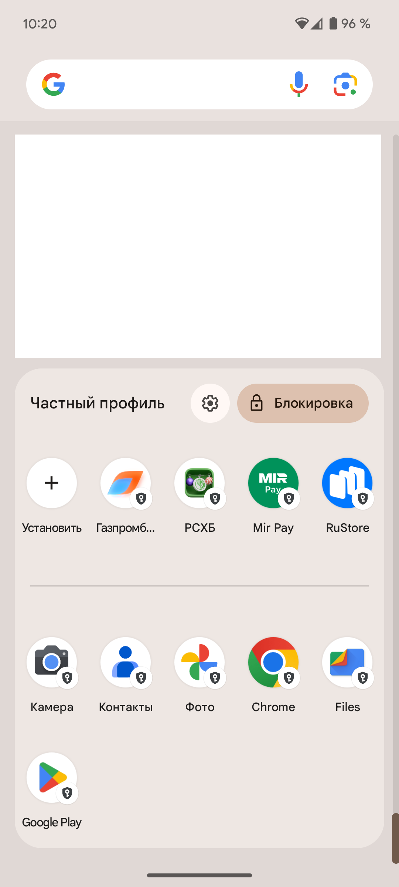
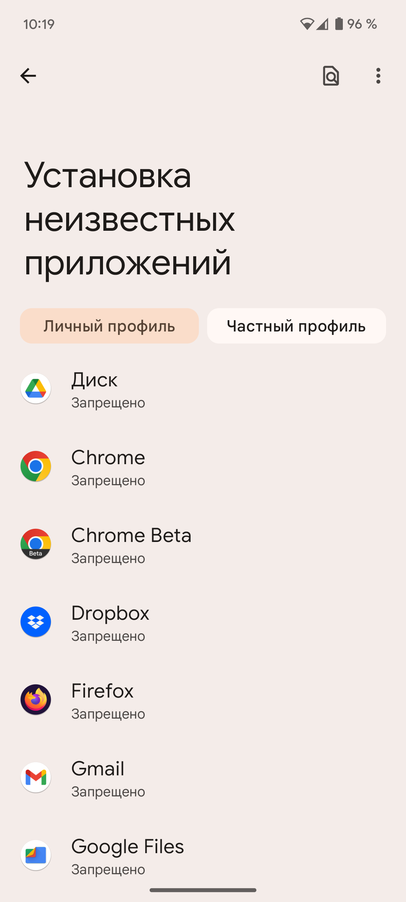
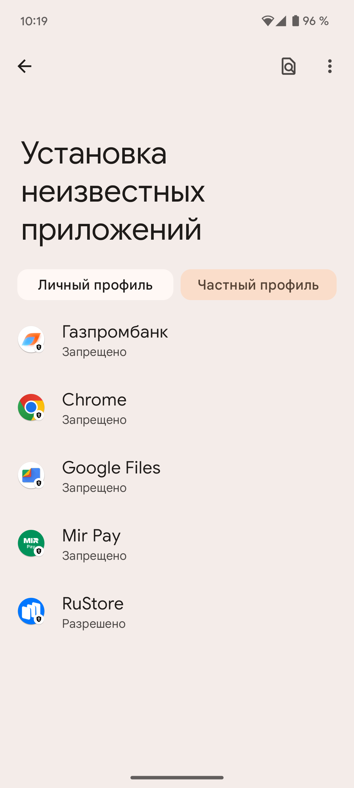
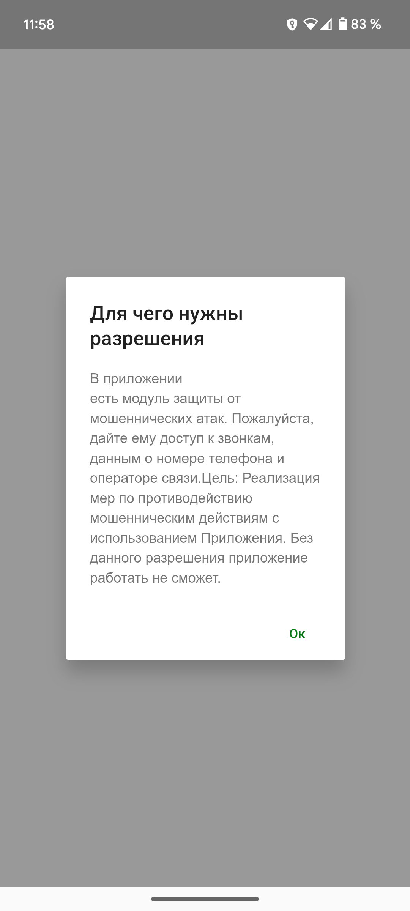
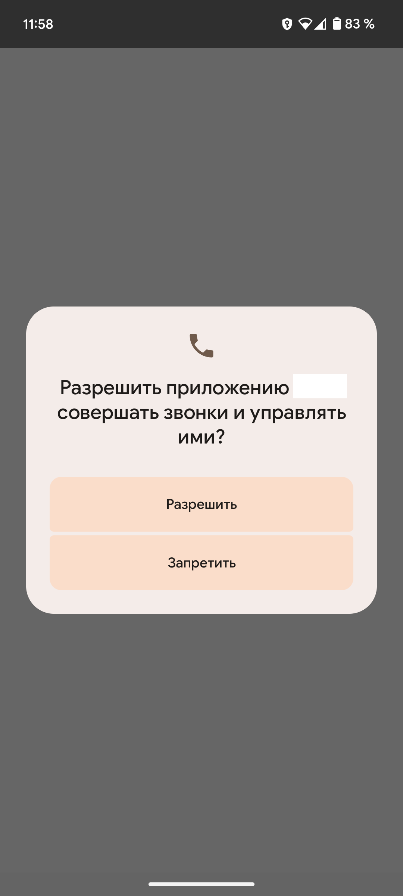
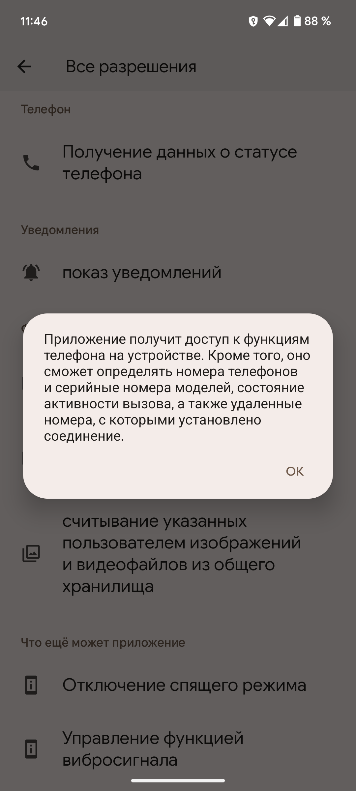

# Неожиданное использование "Частного пространства" (Private space) в Android 15

## Disclaimer

Автор делится личным опытом, полученным на собственном смартфоне Google Pixel, и не призывает ни повторять,
ни избегать описанных действий.
Все возможные последствия использования этой информации остаются на ответственности читателя.

## Профили

Профили в Android не новость. Возможность создать дополнительный профиль была и до Android версии 15.

Однако, это совсем не те профили, которые можно было бы использовать одновременно с основным,
как можно использовать параллельно несколько профилей в приложениях, например, в том же Gmail. 

В Android 15 появилась возможность создать дополнительный профиль, который можно использовать одновременно с основным.
Это [Private space](https://support.google.com/android/answer/15341885?hl=en) или 
[Частное пространство.](https://support.google.com/android/answer/15341885?hl=ru-Ru)

Само по себе *Частное пространство* это шаг в правильном направлении, но давайте скажем честно, что такой
подход будет работать далеко не во всех ситуациях. Это пространство было бы гораздо более защищённым, если бы можно
было полностью скрыть следы его присутствия в телефоне, даже попавшем в чужие руки хорошо подготовленного человека.

Сейчас это отличный способ скрыть приложения от случайного попадания телефона разве что в руки доброжелательно
настроенных близких людей.

## Идея

Вместе с тем, это совсем не бесполезная вещь. У нас теперь есть полноценно работающий дополнительный профиль,
который можно использовать, как песочницу для установки приложений. 

Например, именно туда можно поставить дополнительный аппстор (магазин приложений).
Все такие приложения хотят иметь права на установку и обновление других приложений, что логично.

Фокус в том, что пользователь сможет увидеть все такие приложения на одном экране, а при желании и запускать
эти приложения только в этой песочнице.



## Обновления приложений

Есть ещё один положительный эффект, который основан на особенностях реализации профилей в Android.

Когда приложение, уже установленное в одном из профилей, устанавливается в другом, реальной установки не происходит.
На устройстве может быть только один apk с одним идентификатором. 
При этом данные приложения у каждого профиля конечно свои.

Таким образом, если обновлять приложение в одном профиле, оно обновляется сразу во всех профилях.

В условиях, когда приложение исчезает из Google Play, но альтернативным аппсторам не хочется давать слишком много
прав, или у нас отдельное приложение, обновляющее само себя (и сам альтернативный аппстор здесь, как частный случай),
можно попробовать такой подход.




## Права приложений в Частном пространстве

Не нужно сильно полагаться на то, что в Частном пространстве недоступна какая-то информация об устройстве.

Да, если приложение попросит список других приложений, оно увидит только список из Частного пространства. 

Многие банковские и некоторые другие приложения просят дополнительные права.
Как это часто бывает, под предлогом защиты самого пользователя.




В этом случае у приложения будут те же права на этот API, что и у приложений в обычном профиле.

Даже текст описания доступных прав в системе для "Получения данных о статусе телефона" не самый приятный.



К счастью, именно в этом месте Android уже несколько версий
[не отдаёт постоянные идентификаторы](https://developer.android.com/about/versions/10/privacy/changes?hl=ru#non-resettable-device-ids)
(та же ссылка 
[на английском](https://developer.android.com/about/versions/10/privacy/changes?hl=en#non-resettable-device-ids)).

## Установка приложения из частного профиля в основной профиль

Если приложение не присутствует в Google Play и оно было установлено через аппстор сразу в Частном профиле, 
для доступа к нему в основном профиле можно выполнить следующую команду
```shell
adb shell pm install-existing --user 0 com.example.app
```
*com.example.app* здесь идентификатор приложения, а *0* – идентификатор профиля.

Посмотрим список идентификаторов профилей
```shell
adb shell pm list users
```

Будет что-то вроде 
```text
Users:
    UserInfo{0:User:xxxx} running
    UserInfo{10:Private space:xxxx} running
```
Здесь 0 – основной профиль, а 10 – частный профиль.

Теперь список идентификаторов приложений для частного профиля (без системных приложений) можно получить командой
```shell
adb shell pm list packages --user 10 | egrep -v "^package:(com\.(android|google|samsung|verizon|shannon|vzw)|android)" | sort
```

Используемую здесь команду `adb` можно найти [здесь](https://developer.android.com/tools/adb)
или в менеджерах пакетов вашей платформы.
Как вариант, можно найти приложение терминал и выполнить там `pm`

## Вывод

Можно конечно не думать обо всём этом, поставить альтернативный аппстор в основной профиль и получать обновления.
Тем более, что на первый взгляд от этого не очень много пользы.
Однако, всегда приятно попробовать немного усложнить сбор данных о себе и угадать возможные неожиданности в будущем.
Кто знает, что делает альтернативный аппстор, пока вы спите 🙂

#### Copyright © 2025 Oleg Okhotnikov. All rights reserved.

